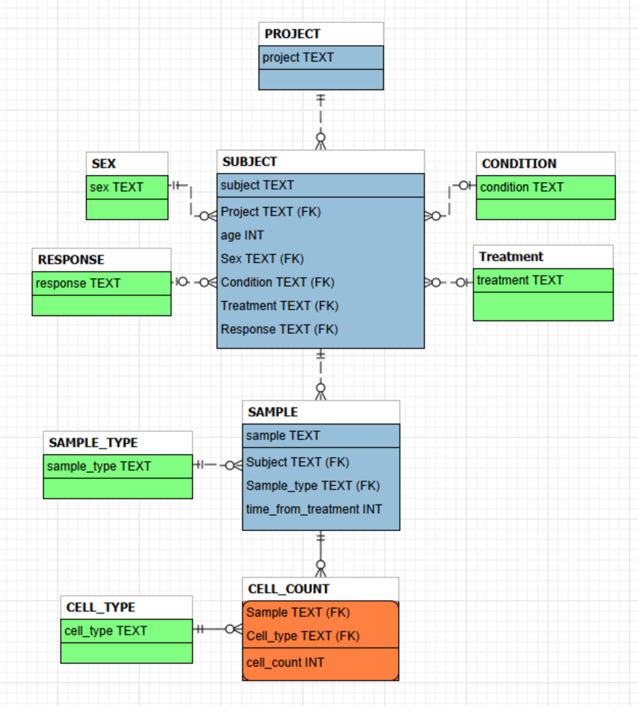

# Immune Cell Population Investigation
Author: Nathaniel Schoppa
Date: July 02 2026
---

## Introduction

Hello there Bob! As requested, I've delivered a tool for investigating immune cell populations.

To get things started, run the makefile and open a browser to http://localhost:5173/

The application creates a SQLite database called **teiko.db**. You can access it for future uses, but the application handles all the SQL calls. This should satisfy your requirement *part 1: data management*. The databased is structured according to the ERD below. Green are reference entities, blue are strong entities, and orange are weak entities.

This database is designed to effectively scale for thousands of projects and alternate cell types without disturbing extant data. 

Under this design, all recorded data must be attached to a project. Currently, the database does not store project metadata (e.g. timeframe, people involved, location, etc.) but can be expanded to include these features. 

Each project can have a number of subjects, referring to the specimen or individual cells were collected from. Subjects additionally have a number of metadata attributes, such as their sex, age, if they have a condition, if they are undergoing a treatment, and if there is a response. All non-numeric attributes are handles through reference entities, improving data integrity and making it easy to add new values without disturbing extant data. It is also easy to update the table definition and add additional metadata. Note that currently each subject is only attached to a single project, preventing subject re-use. This orientation makes the most sense under the current design instructions and example data, and additionally supports limiting data access (e.g. restricting queries to specific projects). If future operations require re-using subjects, the design will creating an intersection entity between project and subject, and linking this subject in project to sample instead.

Each subject can have a number of samples, which have non-numeric metadata as reference entities. This architecture supports data integrity by ensuring data is stored once and referenced as needed. Like for subject, it is highly modifiable. Importantly, this design supports data confidentiality: data access can be restricted to sample and cell count, enabling a user to access stored data **without** exposing subject metadata.

Finally, actual cell counts are stored as an intersection between sample and cell type. This stores all cell count data in a single table, enables expanding tested cell types by adding values to the cell type table, and removes constraints on which cell types were collected for each sample. This makes data storage flexible, although it imposes a significant merge load. In the future, this table can be partitioned by project to improve data storage while maintaining table properties.

Overall, this design supports data confidentiality, scalability, and data integrity. Let me know if there is a core design requirement, such as subjects being able to participate in multiple projects, not captured by this design.

From here, I'll cover the sectionds and where to find information.

---

## Section 1 - Data Overview: Cell Counts

This section contains a live, filterable datatable of per sample cell type proportions. Use the arrows by column names to sort the dataset, **Filter by Sample** and **Filter by Cell Type** dropdowns (left and right) to select specific samples or cell types, and the blue **Export** button to download the current dataset snapshot as a CSV.

It should contain the information necessary to answer *part 2: initial analysis*, the frequency of each cell type in each sample. The dataset is formatted according to your specifications.

---

## Section 2 - Data Overview: Cell Counts

This sections contains a live boxplot of cell type proportions with selectable level and filters. If there is enough levels to by, then the section will additionally complete a multiple t-test and report adjusted p-values. Use the **Split by** dropdown (left) to select comparison level and **Narrow Down Conditions** dropdown (right) to filter the data. Note that some filter combinations won't select any data; this is expected.

I've pre-loaded the filter and level to meet your request for **part 3: statistical analysis**: comparing **PBMC** samples of **melanoma** patients receiveing **miraclib** over **response** (yes or no). Excitingly, *cd4_t_cell* frequencies appear to differ between patients that respond to miracleb. Hopefully these tests should be of use to Yah D’yada.

---

## Section 3 - Cell Count Data

This section contains a live, filterable datatable of sample cell counts and metadata. The top row is a average summary for each cell type. Use the **Pivot over columns** dropdown (left) to choose which metadata columns to aggregate or compare over. By default, all columns are depicted. Note that if sample ids are shown, then the table depicts sample cell counts. If sample id is removed, then the table will depict averaged cell counts. Use the **Narrow Down Conditions** dropdown to filter the dataset. Note that, like in Section 2, some combinations will return no data. Use the **Show Proportions** toggle to swap the dataset between cell counts and cell type frequencies. Finally, like in Section 1, press the blue **Export** button to download the current dataset snapshot as a CSV.

Below the data table, there are two preset buttons to reset columns and filters. The top (1) will set filters to the default while the second removed the PBMC requirement but filters for male subjects. These two filters will aid completing **part 4: data subset analysis** of your request. Finally, below, there are bars depicting the unique metadata values present in the current selection. Use that to find the unique counts for each column and total number of subjects or samples, if appropriate.

Use the first filter (or default state) to find all melanoma PBMC samples at baseline from patients who have been treated with miraclib. From there, you can find how many samples from each project, how many subjects were responders/non-responders, and how many subjects were males/females. 

To determine the average number of B cells for melanoma male responders at baseline (not PBMC), use the second filter and look at the top summary row.

---

It has been a pleasure developing this for you, Bob. 

Please let me know if you encounter any issues with the application, or have a use case not covered.
